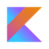

#  Base Module
[](https://kinecosystem.github.io/kin-android/docs)
[ ](https://bintray.com/kinecosystem/kin-android/base/_latestVersion)

The [:base](../base) module is the foundation upon which the rest of the SDK stands. However, it can be used on its own to headlessly access the Kin Blockchain. It's pure JVM but used as the basis for other Android-specific modules in the SDK.


 This is a Kotlin first library, but it's also fully available to Java developers.

*For Java developers that prefer more conventional Java callback/listener idioms, see [Java Idioms](#java-idioms) below.*

## Installation
Add the following to your project's gradle file.
```groovy
dependencies {
    // ...
    implementation "org.kin.sdk.android:base:${versions.kin}"
}
repositories {
    // ...
    jcenter()
    maven { url "https://jitpack.io/" } // Jitpack is used for OkSSE fork only
}
```

## Overview
The base module contains two main components that are to be instantiated and used by the developer:
- a `KinEnvironment` instance to describe the network (test or production) and provide some external dependencies
- a `KinAccountContext` instance to access functionality of a Kin account on the Kin Blockchain, provide local storage for your private key, and provide a data cache for account and payment history data.
Below you'll find a general overview on how to use the base module, but also consider diving into the specific documentation [found here](https://kinecosystem.github.io/kin-android/docs) for more details or [check out some of the other modules](../) that work together with base.

## Quick Start
Everything starts with a `KinEnvironment` instance that describes which blockchain, services, and storage will be used.

### Agora Kin Environment
The Agora Kin Environment is now the preferred method of communicating with the Kin Blockchain. Agora is both a gateway to submit payments and a history collector that can be used to resolve your full payment history.
When submitting payments, a developer should properly configure an [Agora webhook](https://docs.kin.org/how-it-works#webhooks), which acts as a delegate to approve and optionally co-sign a transaction to mediate transaction fees.
Agora can also store additional meta-data about your transaction concerning what your payments were for. This bundle of information is called an `Invoice`, offchain data which is referenced by the payment's associated `Memo`. You can read more about both below in the [Sending Payments section](#sending-payments).

You'll also need to tell the SDK a bit about your app in an AppInfoProvider implementation to work with some features (like paying and resolving Invoices and the [spend](../spend) module UI).
There are two bundles of information an App provides through this interface:
- An AppInfo object to describe the App. This contains your App's unique App Index whcih you can obtain by registering [here](https://docs.kin.org/app-registration)
- Passthrough Auth User Credentials are passed onto the webhook when submitting a transaction

For more information regarding webhooks and webhook integration please read more about [how it works](https://docs.kin.org/how-it-works#webhooks).
```kotlin
val environment: KinEnvironment =
    KinEnvironment.Agora.Builder(NetworkEnvironment.KinStellarTestNetKin3)
        .setAppInfoProvider(object : AppInfoProvider {
                    override val appInfo: AppInfo =
                        AppInfo(
                            DemoAppConfig.DEMO_APP_IDX,
                            DemoAppConfig.DEMO_APP_ACCOUNT_ID,
                            "Kin Demo App",
                            R.drawable.app_icon
                        )

                    override fun getPassthroughAppUserCredentials(): AppUserCreds {
                        return AppUserCreds("demo_app_uid", "demo_app_user_passkey")
                    }
                })
        .setStorage(KinFileStorage.Builder("path/to/storage/location"))
        .build()
```

### Horizon Kin Environment
Horizon access from the SDK has been deprecated. While it's still included in the SDK and can be used, it may become unavailable in a future blockchain migration.
```kotlin
// DEPCRECATED - SEE KinEnvironment.Agora
val environment: KinEnvironment =
    KinEnvironment.Horizon.Builder(NetworkEnvironment.KinStellarTestNet)
        .setStorage(KinFileStorage.Builder("path/to/storage/location"))
        .build()
```
For a given `KinAccount` that you want to operate on, you will need a `KinAccountContext` instance.
This will be used to both create and access all `KinAccount` and `KinPayment`s.

 ```kotlin
var context: KinAccountContext =
    KinAccountContext.Builder(environment)
        .createNewAccount()
        .build()
```

### Note on Upcoming Solana Migration
With the migration to Solana just around the corner, apps that want to continue to function during and post the move to the Solana blockchain are required to upgrade their `kin-android` sdk to 0.4.0 or higher.
*Any application that does not upgrade will start to receive a `KinService.FatalError.SDKUpgradeRequired` exception on any request made from `KinAccountContext`.*

#### Testing migration within your app
To enable migration of Kin3 -> Kin4 accounts on testnet, `KinEnvironment.Builder` instances have a
new option, ``.testMigration()` that will force this sdk into a state where migration will occur on demand.

#### On Migration Day (Dec 8, 2020)
Apps should expect to see increased transaction times temporarily on the date of migration.
An on-demand migration will be attempted to trigger a migration, rebuild, and retry transactions that are submitted from an unmigrated account on this day and optimistically will complete successfully but are not guaranteed.
After all accounts have been migrated to Solana, transaction times should noticeably improve to around ~1s. Additional performance improvements are still possible and will roll out in future sdk releases.

### Kin 2 Support
*For those apps that are still on Kin 2 and require support for Kin 2 -> Kin 4 migration*
You should configure your KinEnvironment to use the Kin 2 NetworkEnvironment as follows:
```kotlin
 KinEnvironment.Agora.Builder(NetworkEnvironment.KinStellarTestNetKin2)
```

*Failure to do this will default your app to start on Kin 3 which will create a new account for your users on Kin3 with a 0 Kin balance. You probably do not want to do this.*


### *As you may notice on the `KinAccountContext.Builder`, there are a few options for configuring a `KinAccountContext`...*

## Creating An Account
If you want to create a new `KinAccount`:
```kotlin
.createNewAccount()
```
## Access An Existing Account
If you want to access an existing `KinAccount` with options to send `KinPayment`s, input the `KinAccount.Id` with:
```kotlin
.useExistingAccount(KinAccount.Id("GATG_example_and_fake_key"))
```
*Note: this variant requires that the `KinEnvironment` knows about this `KinAccount`'s `Key.PrivateKey` which can be imported the first time by:*
```kotlin
environment.importPrivateKey(Key.PrivateKey("SDR2_example_and_fake_key"))
    .then { success: Boolean ->
        // Completed
    }
```
## Read Only Account Data
For `KinAccount`s that you do **not** have a `Key.PrivateKey` for and only desired read-only access to the data associated with that account:
```kotlin
.useExistingAccountReadOnly(KinAccount.Id("GATG_example_and_fake_key"))
```

## Sending Payments
Sending `KinPayment`s is easy. Just add the amount and the destination `KinAccount.Id`.

*Note: successive calls to this function before the previous is completed will be properly queued according to blockchain implementation needs.*
```kotlin
context.sendKinPayment(KinAmount(5), KinAccount.Id("GATG_example_and_fake_key"))
    .then { payment: KinPayment ->
        // Payment Completed
    }
```
Sending a batch of payments to the blockchain to be completed together, in a single transaction, is just as easy.

*Note: This operation is atomic. All payments will either succeed or fail together.*
```kotlin
context.sendKinPayments(
    listOf(
        KinPaymentItem(
            KinAmount(5),
            KinAccount.Id("GATG_example_and_fake_key")
        ), KinPaymentItem(
            KinAmount(30),
            KinAccount.Id("GBCA_example_and_fake_key")
        )
    )
).then { completedPayments: List<KinPayment> ->
    // Payments Completed
}
```

 Paymments made within this library are automatically retried, if the error permits being retried, up to 5 times with exponential backoff starting at 1 second after the first attempt (i.e. 1s, 2s, 4s, 8s intervals).

### Are there Fees?
It depends. By default, payments on the Kin Blockchain are charged a minimal fee of 100 Quark (1 Quark = 0.001 Kin) each. The minimum required fee is dictated by the Blockchain. Fees on the Kin blockchain are an anti-spam feature intended to prevent malicious actors from spamming the network. Registered Kin apps are given a whitelisted account, which they can use to exempt their or their users' transactions using the [Sign Transaction webhook](https://docs.kin.org/how-it-works#sign-transaction).

When using `KinAccountContext` configured with the Agora KinEnvironment, by default a fee will not be added to the payment unless you specifically want your users to pay fees instead of you providing whitelisting. This can be achieved by overriding and setting the `isWhitelistingAvailable` parameter to false in the `KinTransactionWhitelistingApi` instance when configuring your `KinEnvironment` instance.

### How can I add more data to the payment?
#### Memos
Memos are only 32 bytes of data that are stored on the blockchain with your payment data. Because of this, it's recommended to only include data you can use to reference a larger set of data off chain.

#### *Kin Binary Memo Format (Recommended)*
The Kin Binary Memo Format is defined by [this spec](https://github.com/kinecosystem/agora-api-internal/blob/master/spec/memo.md) and includes the following fields:
- Version: the memo encoding version (primarily used by the SDKs for interpreting memos).
- Transaction Type: the 'type' of the transaction the memo is embedded in.
- App Index: a 16-bit value that refers to the app the transaction is related to. Replaces app IDs.
- Foreign Key: the identifier in an auxiliary transaction service that contains metadata about what a transaction is for.

Apps that are migrating from the old AppId format can check out details [here](https://docs.kin.org/how-it-works#memo-format-and-app-index)

Use the `KinBinaryMemo.Builder` class to construct a `KinBinaryMemo`.
The `KinBinaryMemo.TransferType` is important to set appropriately for the type of payment you are making (Earn/Spend/P2P) (See KDoc definitions for more details).
The new foreign key field primarily serves as a way for apps to include a reference to some other data stored off-chain, to help address memo space limitations. This field has a max limit of 230 bits. One option available to developers for storing off-chain data is [invoices](#invoices), which can help developers provide their users with richer transaction data and history. However, developers are free to use the foreign key to reference data hosted by their own services.
```kotlin
 KinBinaryMemo.Builder(appIndex)
            .setTranferType(KinBinaryMemo.TransferType.P2P)
            .setForeignKey(someForeignKeyModel.toByteArray())
            .build()
```
#### *Text Memos (Old style memos)*
In this SDK you can provide a text based memo by using the `ClassicKinMemo` class. This format should only be used by existing apps that have been issued AppIds and have yet to upgrade to the new Kin Binary Memo Format.

#### Invoices
[Invoices](https://docs.kin.org/how-it-works#invoices) are a great way to leverage Agora to store data about your payments off-chain for you to retrieve later (e.g. in your payment history). They can be submitted to Agora via the optional invoice field of `sendKinPayment` method with a properly formatted KinBinaryMemo which is used to reference the applicable Invoice data at a later time.

An invoice for a payment contains a list of line items, which contain the following information:
- **title**: the title of a line item.
- **amount**: the amount of a line item.
- **description** (optional): the description of the line item.
- **sku** (optional): an app-specific identifier. This can be anything developers wish to include (e.g. a product ID).

The `Invoice.Builder` class can be used to construct an Invoice to operate on. As an app that sells a set of digital goods or services, you may wish to transform the information you have in your own models into an Invoice object and reference it later via its identifier stored in the SKU.
```kotlin
val invoice = Invoice.Builder()
            .addLineItem(
                LineItem.Builder("Start a Chat", KinAmount(50))
                    .setSKU(SKU(someProductIdModel.toByteArray()))
                    .build()
            )
            .build()
```

To execute a payment for an `Invoice`, you can make use of the `payInvoice` convenience function on `KinAccountContext`. This essentially calls `sendPayment` on your behalf with the correctly formatted `KinBinaryMemo` and TransferType of `KinBinaryMemo.TransferType.Spend`. Invoices can and should also be used for other TransferTypes such as P2P and Earns.

*The destinationKinAccountId must match the expected & registered destinationKinAppIdx provided [during registration](https://docs.kin.org/app-registration)*
```kotlin
context.payInvoice(invoice, destinationKinAccountId, destinationKinAppIdx).then { kinPayment ->
    // Payment Completed
}
```

If an `Invoice` was included with the submission, the optional invoice field on the `KinPayment` will be populated with the Invoice. This is especially helpful when observing your [payment history](#retrieving-payment-history)
```kotlin
kinPayment.invoice
```

*Note:* If you are paying for an `Invoice`, you *must* use the Kin Binary Memo Format for the memo.*

## Retrieving Account Data
The `KinAccount.Id` for a given `KinAccountContext` instance is always available
```kotlin
context.accountId
```
If you require more than just the id, the full `KinAccount` is available by querying with:
```kotlin
context.getAccount()
    .then { kinAccount: KinAccount ->
        // Do something with the account data
    }
```
Observing balance changes over time is another common account operation:

*Note: don't forget to clean up when the observer is no longer required! This can be accomplished via a `DisposeBag`, or by calling `.remove(listener)` on the `Observer`*
```kotlin
val lifecycle = DisposeBag()
context.observeBalance()
    .add { kinBalance: KinBalance ->
        // Do something on balance update
    }.disposedBy(lifecycle)
```

## Retrieving Payment History
Whether you're looking for the full payment history or just to be notified of new payments, you can observe any changes to payments for a given account with:
```kotlin
context.observePayments()
    .add { payments: List<KinPayment> ->
        // Will emit the full payment history by default
        // @see ObserverMode for more details
    }
    .disposedBy(lifecycle)
```
Sometimes it's useful to retrieve payments that were processed together in a single `KinTransaction`
```kotlin
context.getPaymentsForTransactionHash(TransactionHash("<txnHash>"))
    .then { payments: List<KinPayment> ->
        // Payments related to txn hash
    }
```

## Other
When done with a particular account, you can irrevocably delete the data, **including the private key**, by performing the following:
```kotlin
context.clearStorage()
    .then { success: Boolean ->
        // The data with this KinAccountContext is now gone forever
    }
```

## Having Trouble with Dependencies?
Alternatively, there is a shaded artifact for those who are having difficulty resolving common dependencies (e.g. grpc, guava, other google transitive deps)
```groovy
dependencies {
    // ...
    implementation "org.kin.sdk.android:base-shaded:${versions.kin}"
}
```
This variant is recommended when encountering dependency collisions (e.g. duplicate classes, incompatible versions, etc).
If you are still encountering difficulties with dependency collisions with this variant, we recommend forking the library and adding additional libraries you want to shade to the list included under the shadowJar task configured in [../base/build.gradle](build.gradle).


## Java Idioms
Instead of Promise .then tail calls in Java...
```java
context.getAccount(new Callback<KinAccount>() {
        @Override
        public void onCompleted(@Nullable KinAccount value, @Nullable Throwable error) {

        }
    });
```
Instead of Observer .add tail calls in Java...
```java
context.observeBalance(ObservationMode.Passive.INSTANCE, new ValueListener<KinBalance>() {
        @Override
        public void onNext(KinBalance value) {
            // do something
        }
        @Override
        public void onError(@NotNull Throwable error) {
            // handle error
        }
    }).disposedBy(lifecycle);
```
Tail calls in Java with lambdas...
```java
context.getAccount()
    .then(account -> null);

context.observeBalance(ObservationMode.Passive.INSTANCE)
    .add(kinBalance -> Unit.INSTANCE)
    .disposedBy(lifecycle);
```
Tail calls in Java *NO* lambdas...
```java
context.getAccount()
    .then(new Function1<KinAccount, Unit>() {
        @Override
        public Unit invoke(KinAccount kinAccount) {
            return null;
        }
    });

context.observeBalance(ObservationMode.Passive.INSTANCE)
    .add(new Function1<KinBalance, Unit>() {
        @Override
        public Unit invoke(KinBalance kinBalance) {
            return null;
        }
    })
    .disposedBy(lifecycle);
```

## Proguard rules

Since base is just a jar we can't include a consume-proguard rules file automatically
(like ../base-compat/consumer-rules.pro for base-compat does) and you may want to use the suggested proguard rules below.

*It's very possible you're able to refine them much further than we have and will try to refine these further ourselves in the future*

```
## OkHttp
-dontwarn okhttp3.**
-dontwarn okio.**
-dontwarn javax.annotation.**

## Gson
-keepattributes Signature

# For using GSON @Expose annotation
-keepattributes *Annotation*

# Gson specific classes
-dontwarn sun.misc.**

# Application classes that will be serialized/deserialized over Gson
-keep class org.kin.stellarfork.responses.** { <fields>; }

# Prevent R8 from leaving Data object members always null
-keepclassmembers,allowobfuscation class * {
  @com.google.gson.annotations.SerializedName <fields>;
}

# Prevent proguard from stripping interface information from TypeAdapterFactory,
# JsonSerializer, JsonDeserializer instances (so they can be used in @JsonAdapter)
-keep class * implements com.google.gson.TypeAdapterFactory
-keep class * implements com.google.gson.JsonSerializer
-keep class * implements com.google.gson.JsonDeserializer

# Ignore usages of x509 in eddsa library as it's not in use in our case
-dontwarn sun.security.x509.**

-dontwarn io.envoyproxy.**
-dontwarn org.kin.shaded.**
-dontwarn org.kin.sdk.**
-dontwarn java.lang.ClassValue

# definitely need
-keep class org.kin.sdk.base.network.services.KinService.*$* {*;}
-keep class org.kin.agora.gen.** {*;}
-keep class org.kin.agora.gen.**$* {*;}
-keep class org.kin.agora.gen.account.v3.AccountService {*;}

## Trying to avoid these below by refining further in the future...
# For normal builds
-keep class org.kin.*$* {*;}
-keep class org.kin.**$* {*;}
-keep class io.grpc.** {*;}
-keep class org.kin.** {*;}

# For shaded builds
-keep class org.kin.shaded.** {*;}
-keep class org.kin.shaded.*$* {*;}
```
