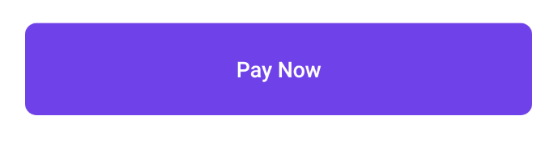
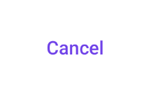
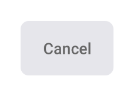
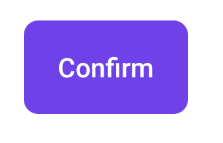
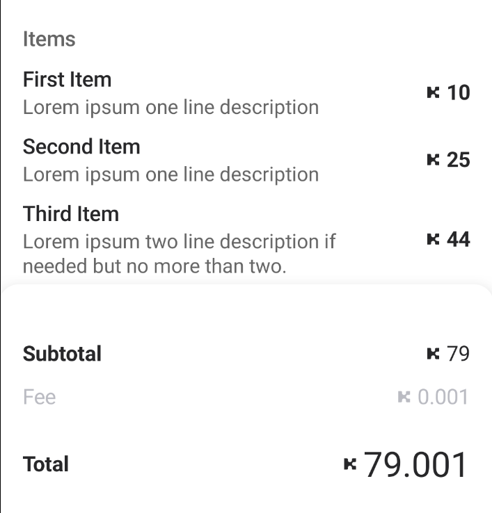
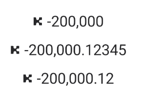
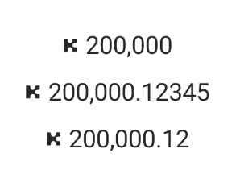

#  Design Module
[](https://kinecosystem.github.io/kin-android/docs)
[](https://maven-badges.herokuapp.com/maven-central/org.kin.sdk.android/design)

The Design library contains the UI components that are used in our full screen experiences like the [spend](../spend) module.
The documented components below are endorsed for external use as well and will be supported in a backwards compatible way (as much as possible) between versions. However, other view components not listed here contained in this module are subject to change or disappear version to version.

Although all of these components *should* also be inflatable from XML (since they should have the proper constructors). That behaviour has not fully been tested.

This library will improve and contain more widgets over time.

All of these components can be tested out and browsed in the [design-showcase app](../design-showcase) which you can compile and run yourself.

## Installation
Add the following to your project's gradle file.
This will also transitively pull in the [base-viewmodel-impl](viewmodel-tools) into your project as well.
```groovy
dependencies {
    // ...
    implementation "org.kin.sdk.android:design:${versions.kin}"
}
repositories {
    // ...
    jcenter()
}
```

##  Overview

### Primary Button

```kotlin
with(PrimaryButton(context)) {
    text = "Pay Now"
}
```

### StandardButton (Inline)

```kotlin
with(StandardButton(context)) {
    text = "Confirm"
    type = StandardButton.Type.TYPE_POSITIVE
}
```

### StandardButton (Negative)

```kotlin
with(StandardButton(context)) {
    text = "Cancel"
    type = StandardButton.Type.TYPE_NEGATIVE
}
```

### StandardButton (Positive)

```kotlin
with(StandardButton(context)) {
    text = "Cancel"
    type = StandardButton.Type.TYPE_INLINE
}
```

### InvoiceRenderer

```kotlin
with(InvoiceRenderer(context)) {
    invoice = RenderableInvoice(
        listOf(
            RenderableInvoice.RenderableLineItem(
                "First Item",
                "Lorem ipsum one line description",
                BigDecimal.TEN
            ),
            RenderableInvoice.RenderableLineItem(
                "Second Item",
                "Lorem ipsum one line description",
                BigDecimal(25)
            ),
            RenderableInvoice.RenderableLineItem(
                "Third Item",
                "Lorem ipsum two line description if needed but no more than two.",
                BigDecimal(44)
            )
        ),
        BigDecimal(10 + 25 + 44),
        BigDecimal(0.001),
        BigDecimal(10 + 25 + 44 + 0.001)
    )
}
```
Or if you're starting with a proper `Invoice` object from the [base](../base) module you can use the utility method `toRenderableInvoice`
```kotlin
val invoice: Invoice
val kinAmountPaid = KinAmount(79.001)
val renderableInvoice = invoice.toRenderableInvoice(kinAmountPaid)
```

### KinAmountView (Negative)

```kotlin
with(KinAmountView(context)) {
    amount = BigDecimal(-200000.12345)
}
```

### KinAmountView (Positive)

```kotlin
with(KinAmountView(context)) {
    amount = BigDecimal(200000.12345)
}
```
